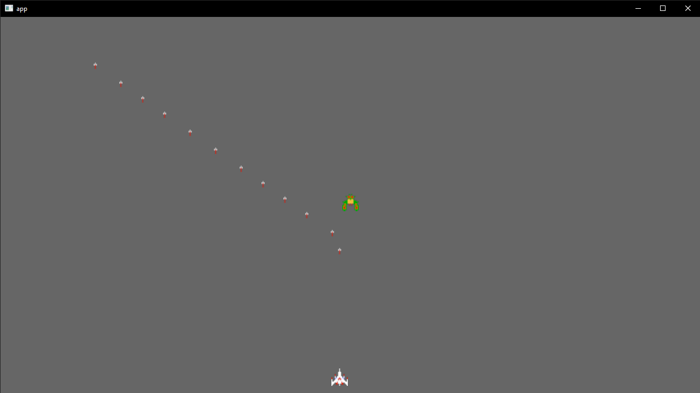

# Galaga Clone in Bevy + Rust

This is a experiment ([and tutorial soon](https://whoisryosuke.com/blog)) to learn how to create a Galaga clone using the Bevy game engine framework and Rust language.

## Requirements

- Rust v1.6.4+

## Getting Started

1. Clone the repo
1. Run `cargo run`
1. Play the game!

## Controls

- **Left/Right** - Move player
- **Spacebar** - Shoot projectile
- **Escape** - Exit game

## How it works

I basically used [the Bevy Breakout game example](https://github.com/bevyengine/bevy/blob/latest/examples/games/breakout.rs) as the basis for a lot of the logic and then branched off where needed.

## Credits

- Namco for Galaga sprites
